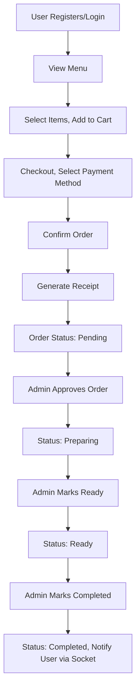

# Food Ordering App Architecture Design

## Overview
This is a food ordering application with separate user and admin interfaces. Users can browse the menu, place orders, and track status. Admins can manage the menu and approve/complete orders.

## Workflow

## Data Models

### User
- name: String (required)
- email: String (required, unique)
- password: String (required, hashed)
- role: String (enum: 'customer', 'admin', default: 'customer')
- createdAt: Date

### Menu
- name: String (required)
- description: String
- price: Number (required)
- category: String
- image: String
- quantity: Number (stock, required)
- available: Boolean (default: true)

### Order
- userId: ObjectId (ref: User, required)
- items: [{ menuId: ObjectId (ref: Menu, required), quantity: Number (required) }]
- total: Number (required)
- status: String (enum: 'pending', 'approved', 'preparing', 'ready', 'completed', default: 'pending')
- paymentMethod: String (enum: 'cash', 'card', 'online', required)
- createdAt: Date

### Payment
- orderId: ObjectId (ref: Order, required)
- amount: Number (required)
- method: String (enum: 'cash', 'card', 'online', required)
- status: String (enum: 'pending', 'completed', 'failed', default: 'pending')
- createdAt: Date

## Backend Routes

### Auth
- POST /api/auth/register
- POST /api/auth/login

### Menu
- GET /api/menus (public)
- POST /api/menus (admin)
- PUT /api/menus/:id (admin)
- DELETE /api/menus/:id (admin)

### Orders
- POST /api/orders (user, authenticated)
- GET /api/orders (user: own orders, admin: all)
- GET /api/orders/:id (user: own, admin: any) - for receipt
- PUT /api/orders/:id/status (admin) - update status

### Payments
- POST /api/payments (user, after order)
- GET /api/payments/:orderId (user/admin)

## Frontend Components

### User Interface
- Login/Register
- Menu List (with add to cart)
- Cart
- Checkout (select payment)
- Order Confirmation/Receipt
- Order History/Status

### Admin Interface
- Login
- Menu Management (add/edit/delete)
- Order Management (view, approve, complete)

## Real-time Updates
Use Socket.IO for order status changes to notify users.

## Dependencies Added
- bcrypt: for password hashing
- jsonwebtoken: for authentication

## Notes
- Menu quantity decreases on order approval.
- Receipt generated on order confirmation.
- Admin controls order status transitions.